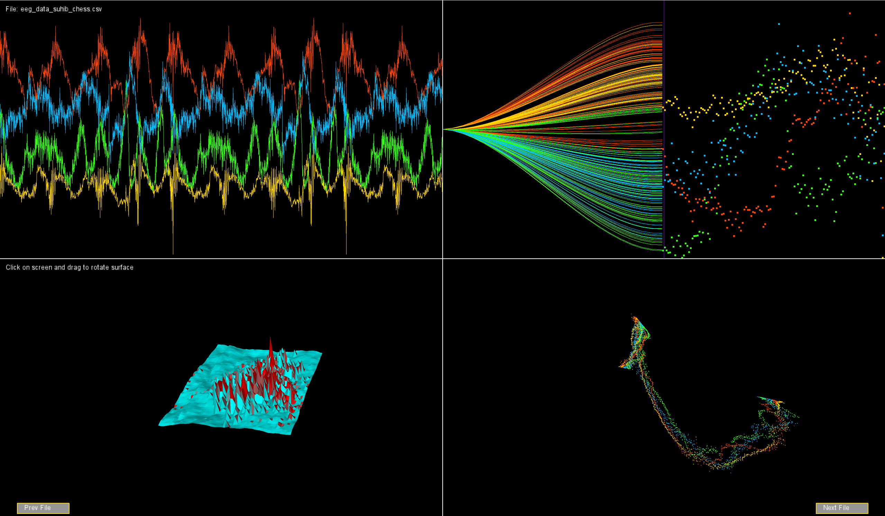

# Muse Mind Band Visualization

## Overview

This project was created as part of the **Mixed Reality** course at the **University of Ostfalia** in Germany. built to visualizes brainwave data from the **Muse Mind Band** using **Processing 4.3**, offering four distinct styles of visualization. While the current code loads data from a file, you can also configure it to work with real-time data from the Muse Mind Band using the **OSC Protocol Library**.

## Features

- Visualizes EEG data in four distinct styles:
  1. **Line Chart**: Real-time graph of EEG signals, similar to a heart-rate monitor.
  2. **Tree-Like Data Flow**: Dynamic branching structures based on EEG data intensity.
  3. **Moving 3D Surface**: A waveform-like 3D surface using four EEG channels (**TP9, AF7, AF8, TP10**) for **x**, **y**, **z**, and **color intensity**.
  4. **3D Scatter Waveform**: A mesmerizing 3D scatter plot with wave-like dynamics.
- **Supports real-time data** through OSC Protocol integration.
- File-based playback for debugging and offline visualization.

---

## Requirements

### Hardware

- **Muse Mind Band** (charged and ready for pairing).

### Software

- **Processing 4.3**: [Download here](https://processing.org/download/).
- Libraries:
  - **oscP5** (for OSC data real-time communication).

---

## Installation

1. Clone the repository:
   ```bash
   git clone https://github.com/SuhibAlsaggar/muse-mind-visualizer.git
   ```
2. Install **Processing 4.3**.
3. Add the **oscP5** library (only for real-time data):
   - Go to **Sketch > Import Library > Add Library...**.
   - Search and install the **Serial** and **OSC** libraries.

---

## Connecting Muse Mind Band for Real-Time Data with OSC

To use real-time data from the Muse Mind Band, follow these steps:

1. **Install Muse Monitor**:

   - Download the [Muse Monitor App](https://www.musemonitor.com/) on your mobile device.
   - Configure it to stream OSC data to your computer's IP and port.
   - Default port: `5000`.

2. **Set Up OSC in Processing**:

   - Import the **oscP5** library and initialize it to receive OSC messages:

     ```java
     import oscP5.*;
     import netP5.*;

     OscP5 oscP5;

     void setup() {
         oscP5 = new OscP5(this, 5000); // Listening on port 5000
     }

     void oscEvent(OscMessage msg) {
         // Parse incoming EEG data and update the visualization
     }
     ```

3. **Run the Visualization**:
   - Open the sketch `MuseVisualizer.pde` in Processing.
   - Ensure your Muse Monitor app is actively streaming OSC data to the correct IP and port.
   - Press `Play` to start the visualization.

---

## Usage

- Connecting Muse Mind Band for Real-Time Data

1. Connect your Muse Mind Band via Bluetooth to your mobile device.
2. Use the **Muse Monitor App** or any data streaming method to stream OSC data to your computer.
3. Press `Play` in Processing to visualize the data.

- File-Based Playback

1. Add the file path with your EEG data file to the fileNames array:
   ```java
   String[] fileNames = {
    "data.csv",
    "data1.csv",
    ...
   };
   ```
2. Press `Play` in Processing to visualize the data.

---

## Examples

Below is a snapshot showcasing the four visualization styles:

- **Line Chart**: Real-time EEG signals.
- **Tree-Like Data Flow**: Dynamic branching.
- **Moving 3D Surface**: Surface chart in 3D space.
- **3D Scatter Waveform**: Point cloud forming waves.



## Acknowledgments

- **University of Ostfalia** and **Professor Dr.-Ing. Reinhard Gerndt** for the opportunity to explore Muse mind band.
- **OSC Protocol Library** for enabling access to brainwave data..
- Open-source contributors for inspiring visualization techniques.

---
